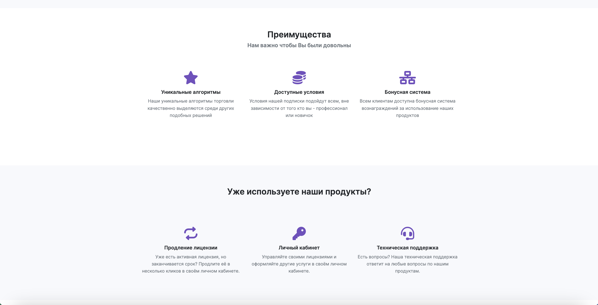
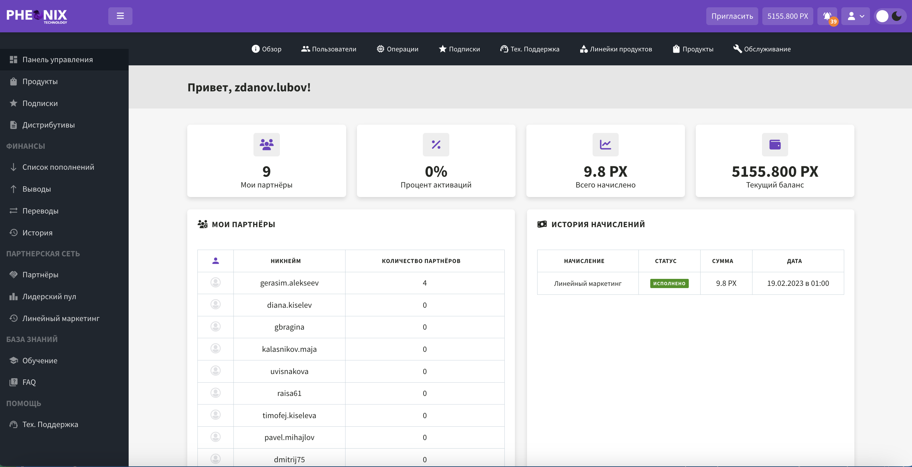
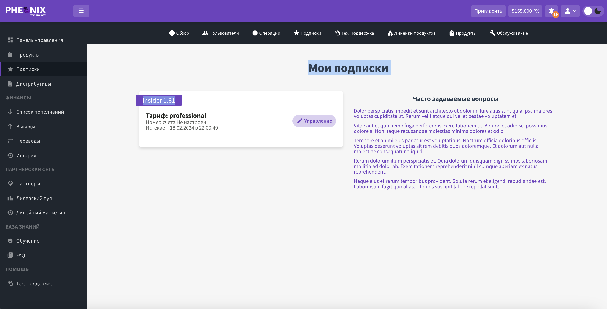
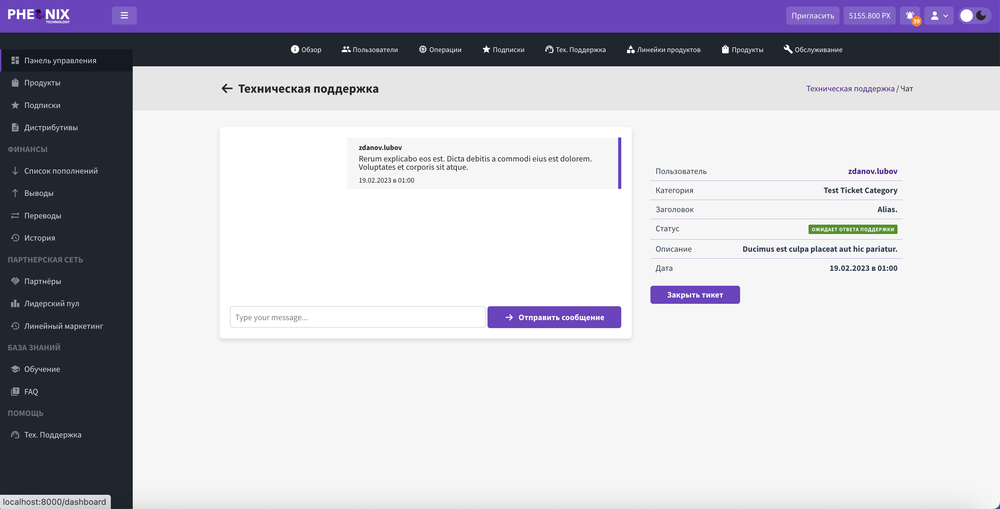

## Features:

- Multilanguage support (en/ru)
- Roles and permissions
- Authentication for SPA (Single Page Applications)
- Integration with Crypto Wallet Service (westwallet.io)
- Rest API
- Email Sending
- Real Time Notifications
- Technical Support Chat
- Ticket System
- User virtual wallets
- Responsive interface written in Vue
- Light/Dark themes

## Examples

These are some example screenshots of a project I was working on.
The project uses Laravel for backend and Vue for frontend.

### Landing Page

### Register Page

### Login Page

### Dashboard

### Subscriptions

### Virtual Crypto Wallet

### Products

### Technical Support Chat

