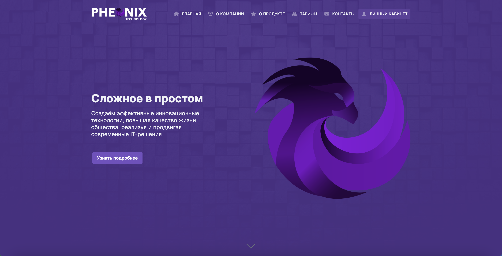
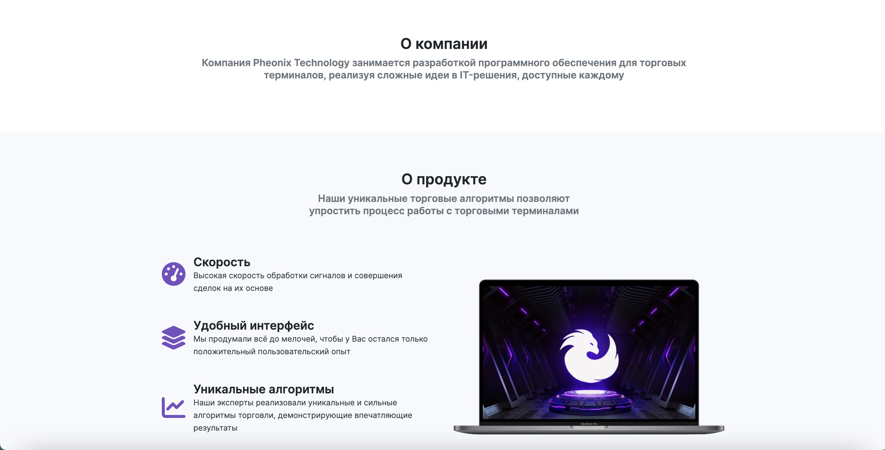
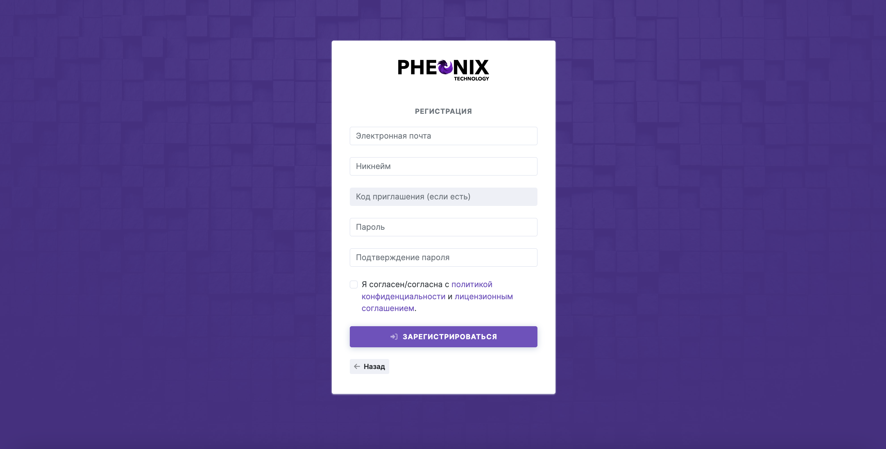
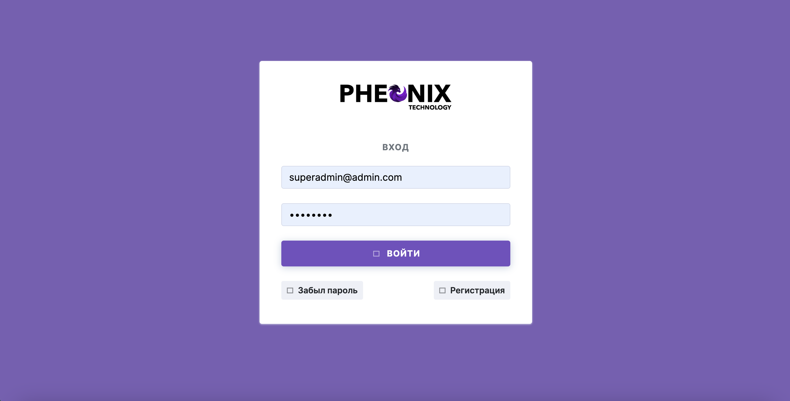
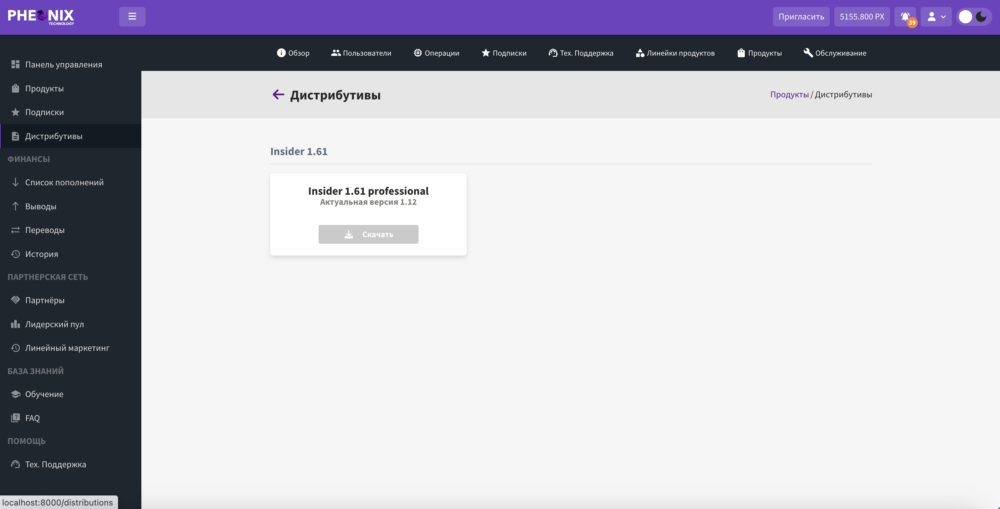
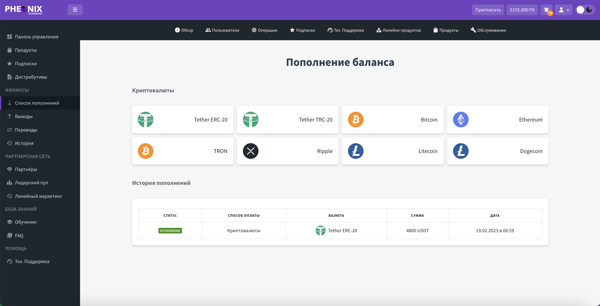
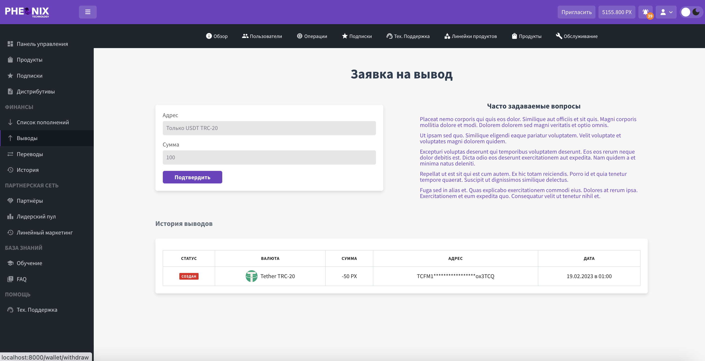
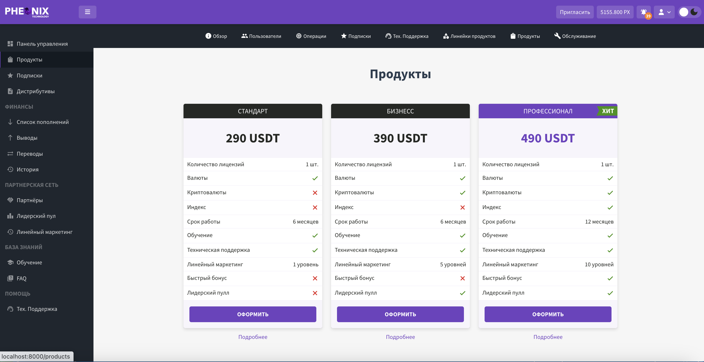

## Особенности:

- Мультиязычность (en/ru)
- Роли и права для сайта
- Аутентификация для SPA (одностраничные приложения)
- Интеграция с сервисом Crypto Wallet (westwallet.io)
- Rest API
- Отправка электронной почты
- Уведомления в реальном времени
- Чат технической поддержки
- Система тикетов
- Пользовательские виртуальные крипто кошельки
- Адаптивный дизайн, написанный на Vue.
- Светлая и темная темы

## Примеры

These are some example screenshots of a project I was working on.
The project uses Laravel for backend and Vue for frontend.

### Посадочная страница

### Регистрация

### Страница входа

### Панель управления

### Подписки

### Виртуальные крипто кошельки

### Продукты

### Чат техподдержки

